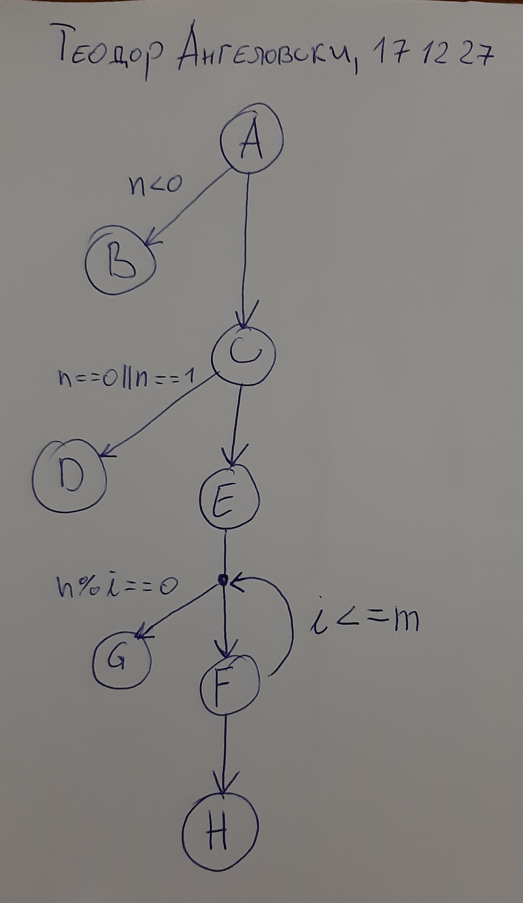

# Поправка на Втора лабораториска вежба по Софтверско инженерство

## Теодор Ангеловски, бр. на индекс 171227

### Група на код: 

Лабораториска вежба 2 - поправка

###  Control Flow Graph

A: int n
B: throw new RuntimeException("Number should not be negative");
C: int m = n / 2;
D: return false;
E: int i = 2;
F: i++
G: return true
H: return false;

Се почнува од јазолот А преку кој се поставува вредност на променливата n како влез на функцијата. Графот тука се разгранува и продолжува во јазолот B доколку е исполнет условот n<0. Јазолот B е терминален јазол и доколку се стигне во оваа точка, се излегува од функцијата. Доколку условот n<0 не е исполнет, се продолжува понатаму со јазолот C каде се иницијализира променливата m. Доколку е исполнет условот n==0||n==1 се преминува во терминалниот јазол D, во спротивно се преминува кон јазолот E. Во овој јазол се иницијализира променливата i на вредност 2. Потоа се проверува условот n%i==0 и ако истиот е исполнет се преминува во терминалниот јазол G. Доколку условот не е исполнет се преминува во јазолот F со кој променливата i се инкрементира за 1. Се проверува условот i<=m и доколку е исполнет, се влегува во следната итерација на for циклусот. Доколку не е исполнет условот се излегува од for циклусот и се преминува во терминалниот јазол H.

### Цикломатска комплексност
E - N + 2*P = 8 - 8 + 2*4 = 8
E - број на ребра
N - број на јазли
P - број на терминални јазли

### Тест случаи според критериумот  Every statement

Every Statement тестирање: за влезни вредности на променливата n ги земаме тест случаите -1, 1, 7 и 8.
За n=-1 се тестираат јазлите A и B
За n=1 се тестираат јазлите A, C и D
За n=7 се тестираат јазлите A, C, E, F и H
За n=8 се тестираат јазлите A, C, E, G
